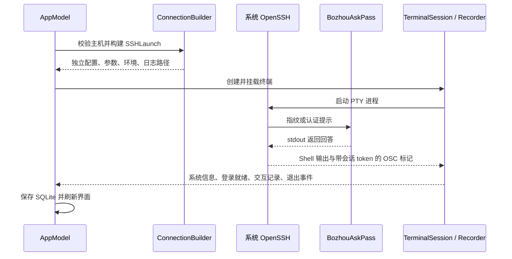

# 泊舟：AI 开发指南

本文描述当前源码与开发约定，是新会话的起点。先核对 `git status`、`VERSION` 和实际源码；不要把本地历史验收文档当作当前实现。面向用户的功能说明见 `README.md`。

## 项目基线

- 原生 macOS SSH 工作台，中文界面；SwiftUI / AppKit、系统 OpenSSH、SwiftTerm、SQLite。
- 开源基线 `1.0.0`，主分支 `main`，标签 `release/v1.0.0`。后续版本以 `VERSION` 为准。
- 运行目标 macOS 14+；编译需 macOS 26 SDK / Xcode 26+。源码对 macOS 26 专有工具栏 API 使用 `#available`。
- Swift Package 使用 Swift 5 语言模式，`swift-tools-version: 5.9`；不要把清单版本误认为可使用旧 SDK。
- 发布与本地验证以 Apple Silicon 为主。CI 使用 `macos-26`、Xcode 26.6、Python 3.14；本地 Python 支持 3.10+。
- 本项目使用 GPT-6-Astra 辅助开发。署名与说明不代表产品集成了在线 AI 服务。

## 开始工作

1. 只读检查分支、未提交改动、工具版本和相关源码，先保留用户已有改动。
2. 对真实服务器或用户工作空间的操作，要明确目标和授权范围。默认使用隔离测试数据。
3. 修复应覆盖问题机制，保持改动集中；完成相关测试，再更新与改动有关的文档。
4. 不将测试成功推断为全平台或远程 CI 已验证，区分本地结果与尚未执行的验证。

```sh
git status --short
cat VERSION
swift --version
xcrun --sdk macosx --show-sdk-version
python3 --version
```

若需指定 Python，设置 `BOZHOU_PYTHON` 为可执行文件路径。先运行 `bash Scripts/build.sh debug` 或 `bash Scripts/test.sh --unit`；脚本自动调用 `prepare.sh`。直接运行 Swift 命令前，在 Bash 中 `source Scripts/prepare.sh`。

## 模块与调用关系

| 文件 / 模块 | 职责与关键入口 |
| --- | --- |
| `BozhouApp.swift` | 应用、菜单、快捷键、退出确认；退出时 `closeAll()` |
| `AppModel.swift` | MainActor 状态、数据操作、连接与会话路由 |
| `HostEditor.swift`、`StableBinding.swift` | 主机编辑；可增删数组的控件绑定按 ID 查找 |
| `HostsPage.swift`、`HostListView.swift` | 文件夹与主机视图；NSTableView 即时选中及双击 |
| `HostQuickLook.swift`、`HostNameLabel.swift`、`HostDisplayName.swift` | 空格只读预览、名称与 hostname 的宽度适配展示 |
| `RootView.swift` | 单行工具栏、工作空间、标签和分屏 |
| `TerminalSession.swift` | PTY 生命周期、录制、重连；`TerminalSurface` 挂载原生终端 |
| `NativeInputTerminalView.swift` | 中文输入法组合文本，提交前不发送到远端 |
| `TerminalAppearance.swift` | 字体、色值校验及前景对比度 |
| `SFTPView.swift`、`ServerTransferView.swift` | 文件浏览和双服务器传输；异步结果用 generation 隔离 |
| `ConnectionBuilder.swift` | 参数校验、展开跳板、生成每次会话独立的 SSHLaunch |
| `ShellIntegration.swift`、`SystemProbe.swift` | Shell 启动 Hook、OSC 字节流解析、登录时只读系统信息采集 |
| `TerminalDiagnostics.swift` | 异常退出状态、有限上下文、私有日志落盘与保留数量 |
| `SFTPClient.swift` | SFTP v3 actor；专属 DispatchQueue 执行阻塞管道 IO |
| `Store.swift`、`Models.swift` | SQLite、Codable 模型、路径与设置 |
| `PasswordCache.swift`、`BozhouAskPass/main.swift` | 逐主机密码复用、认证 UI 与指纹确认 |
| `WorkspaceLocation.swift` | 在线 SQLite 备份与数据目录切换 |



## 必须保持的不变量

### 编辑和界面

- **不得为可删除行保留数组下标 Binding**。原 `ForEach($host.forwards)` 在移除行后被 NSTextField 延迟读取，触发数组越界；使用 `Binding.element(snapshot)`，每次按 ID 查找，删除后读快照、忽略写入。
- 跳板行的移动和删除在执行时按 ID 找当前位置，不捕获旧下标。
- 顶部保持单行平面工具栏、上下居中；避免重新引入液态玻璃背景和第二层 Header。
- 自定义主机名称与实际 hostname 均保留；hostname 同时用于展示、搜索和「登录与系统信息」。
- 名称展示优先完整 `名称(hostname)`，宽度不足使用 hostname 末六位；悬停保留完整文本。未采集时回退连接地址；历史与收藏持久化可选 hostname 快照，旧记录按 hostID 回查。
- 终端内容区头部固定为两行：名称/hostname、用户名与地址端口、文件夹路径同处第一行，连接状态独占第二行；窄分屏内截断而不新增行。
- 主机空格预览不连接、不编辑；空格/Esc 关闭，方向键同步选择，离开主机页关闭预览。
- 主机树展开状态保存在当前工作空间的 `AppSettings.expandedHostGroups`，通过 `AppModel.setHostGroupExpanded` 即时持久化，切页和重启后恢复。收起父目录保留子目录状态，搜索自动展开不改写记录；重命名/移动和删除须在文件夹事务中同步更新路径。
- 默认浅色终端背景 `#F1F2F4`，深色 `#0E141F`；不能恢复纯白底。颜色即时作用于已有终端并持久化。
- 分屏命令作用于焦点窗格；PTY 尺寸与视图同步。
- `⌘−` / `⌘=` / `⌘+` 缩放焦点终端（10–36 pt），会话内保留；显式修改设置字号重置临时缩放。快捷键不得发往远端。

### 连接和异步生命周期

- `TerminalSession.start()` 必须拒绝已关闭或已结束的会话，防止视图排队的迟到启动创建后台进程。
- 每次 SSH 重连重新构建配置和 PTY；旧进程回调用 `source === terminal` 等条件排除。不得重放用户命令。
- 重连等待依次为 5、10、30、60、120 秒，用尽后由用户手动发起。Shell 外层临时启动脚本在退出时发送带会话 token 的完成标记，区分 `exit 255` 与传输失败。只有状态 0 自动关闭标签；非零或未知状态先完成交互记录并保存上下文，保留窗格。Shell 非零退出不触发传输重试。
- PTY 退出通知必须晚于 EOF 和已排队输出交付；后台子进程持有 slave 时最多等 2 秒，然后取消读取并交付尾部。SwiftTerm 改动只写入 `Patches/`。
- SFTP 取消关闭传输；连接、目录、进度和错误回调均要验证 generation，不能让旧任务覆盖新任务状态。
- SFTPTransport 的启动与取消通过锁协调；管道 IO 不进入主线程，帧大小、超时、取消与 SIGPIPE 保护不可删除。
- 服务器间传输使用有界内存、目标临时文件及最终 rename；失败尽力清理并告知残留路径，不覆盖已有文件。

### SSH 和凭据

- 使用系统 `/usr/bin/ssh` 和独立 `-F` 配置，不依赖用户 `~/.ssh/config`。指纹库独立，首次需确认、变化时拒绝。
- 跳板每级保留自己的主机 ID、认证、用户名和端口；嵌套 ProxyCommand 的路径需同时正确处理 Shell 引用和 OpenSSH `%` 展开。
- 密码按当前产品行为明文存于数据库；不得输出到工具日志、进程参数、环境变量或提交。私钥仅保存路径，口令和验证码不持久化。
- AskPass 使用 `Store.savePassword` 仅更新凭据字段，不能回写旧 Host 快照覆盖其他字段。
- 本地转发绑定 `127.0.0.1`，端口冲突使连接失败；SFTP 连接不启动转发。
- 不改写用户或服务器持久化 Shell 配置；不自动安装插件或远端 Agent。
- Zsh 使用原生 `preexec_functions` / `precmd_functions`，不得复制或替换用户 `precmd`；Hook 选项用 `emulate -L zsh` 隔离，内部变量使用 `__bz_` 前缀。临时启动文件由启动脚本兜底清理。用户主动覆盖 Bash `PROMPT_COMMAND` 或清空 Hook 数组允许记录降级，不拦截配置操作。

## 数据与兼容性

- 默认根目录 `~/Library/Application Support/Bozhou/`。`BOZHOU_DATA_DIR` 优先级最高，其次 UserDefaults 的 `workspacePath`，最后默认目录。
- 数据库 `bozhou.sqlite` 使用 WAL。表：`hosts`、`folders`、`identities`、`snippets`、`history`、`pins`、`settings`；记录以 JSON payload 保存。
- 数据库 schema 当前 `user_version=2`，独立于应用版本。**应用回到 1.0.0 不代表将数据库 schema 降为 1**。
- Codable 新字段提供兼容默认值；旧主机、设置、系统信息和日志仍需可读，不能仅为“删除旧逻辑”去掉迁移支持。
- 文件夹操作使用事务。Pin 依命令+输出去重，独立于历史裁剪；单条输出最多 256 KiB、会话侧栏最多 100 条。
- 数据目录迁移使用 SQLite backup API，包含已提交 WAL；目标需为空、互不包含，先校验复制结果再切换指针，保留原目录。
- `Scripts/migrate_workspace.py` 仅用于旧开发工作空间 `.runtime/app` 到默认目录的安装兼容，不覆盖已有数据。
- 会话目录可清理，SSH 原始日志单独保留；应用结构化日志有轮转。
- 异常上下文独立于历史开关保存在工作空间 `logs/*.terminal-context.json`，仅当前用户读写（0600），最多 20 份。只保留终端尾部 64 KiB、SSH 尾部 16 KiB、本次连接最近 5 条交互（每条命令 4 KiB / 输出 8 KiB）；替换当前主机保存密码，不采集环境、SSH 配置或按键。关闭会话不能删除报告；未知敏感业务输出需由用户在分享前检查。

## 构建与依赖

- `Vendor/SwiftTerm` 和 `Vendor/bash-preexec` 是固定提交的 Git 子模块，版本见 `THIRD_PARTY_NOTICES.md`。
- `prepare.sh` 复制并补丁 SwiftTerm 到 `.runtime/SwiftTerm`；根 Package 仅编译其库源码，避免拉入演示依赖。
- Bash 资源由子模块复制到 `Sources/BozhouCore/Resources/`。生成副本不入 Git、不手改；更新依赖应改 gitlink 与 `Patches/`。
- `build.sh` 打包两个可执行文件与资源包。已生成图标在 `Resources/`；需要改图标时手动运行 `generate_icon.swift` 与 `iconutil`，构建不重复改图标。
- `VERSION` 是发布版本源，`package_app.py` 写入 Info.plist，关于页面读取 Bundle 版本；裸可执行文件显示“开发构建”。
- 资源使用明确白名单，`verify_package.py` 验证；禁止将 `Docs/`、真实工作空间或调试材料整目录复制入包。
- `Scripts/install.sh` 默认安装到系统级 `/Applications/泊舟.app`；仅在调用方显式传入目录时使用其他安装位置。
- 当前 ad-hoc 签名，无 Developer ID、公证或自动更新服务。

## 验证选择

| 变更范围 | 命令 |
| --- | --- |
| 核心逻辑、数据、解析、Shell | `bash Scripts/test.sh --unit` |
| Shell 真实 PTY、嵌套 Shell、Vim、粘贴、尺寸压力 | `bash Scripts/test.sh --shell-stability` |
| SSH、认证、多跳、SFTP、转发 | `bash Scripts/test.sh` |
| 编辑绑定、终端关闭、取消回调 | `bash Scripts/test_regressions.sh` |
| 原生终端输入 | `bash Scripts/test_native.sh` |
| 主机键鼠交互 | `bash Scripts/test_hosts.sh` |
| 多会话、分屏、尺寸、颜色 | `bash Scripts/test_hosts.sh --layout` |
| 真实 Window 工具栏 | `bash Scripts/test_titlebar.sh` |
| 安装迁移 / 打包 | Python 执行 `Scripts/test_install.py` / `Scripts/verify_package.py` |

集成 fixture 仅在 `127.0.0.1` 创建随机端口，不连接真实服务器。不要并发运行同一工作区的构建或 fixture。原生回归脚本自动创建临时 `BOZHOU_DATA_DIR`；布局测试会启动本地 Zsh，可能读取当前用户配置，需要时使用隔离 HOME/ZDOTDIR。

Shell 稳定性测试使用临时 HOME；可通过 `BOZHOU_TEST_BASH` 增加另一版本 Bash，`BOZHOU_TEST_OMZ` 指向已有 Oh My Zsh，不安装或更新插件。测试明细在 `.runtime/shell-stability/`，远端复用脚本须先获得真实主机授权。

真实主机探测入口 `--probe-host`、`--live-terminal` 仅限用户明确授权的工作空间和主机；不是默认测试。不要用带完整参数的进程列表检查未知进程，避免暴露认证信息。

## Git 与交付

- `main` 保持可构建；常规修改使用短分支和 PR。不要在后续任务中再次重建历史。
- 提交使用 Conventional Commits；Git author/committer 为 `Zhenxiong Tian <sancpp@qq.com>`，不要在 message 中重复 `Author:`。GPT-6-Astra 实质参与的提交添加 `Co-authored-by: GPT-6-Astra <noreply@openai.com>` 和 `Signed-off-by: Zhenxiong Tian <sancpp@qq.com>` trailers，并使用维护者密钥做加密签名。AI 邮箱仅为协作审计标识，不表示 GitHub 账号或责任主体。
- `release/vX.Y.Z` 使用 signed annotated tag，必须匹配 `VERSION`，指向最终通过测试的提交。
- `CHANGELOG.md` 最新章节对应当前发布版本；Release 工作流将该章节作为发布说明。
- `.github/workflows/ci.yml` 仅验证 PR / main；`.github/workflows/release.yml` 仅由 `release/v*` tag push 触发，测试通过后以 `contents: write` 创建公开 Release，并附带 Apple Silicon ZIP、SHA-256 与 MD5 校验文件。
- Actions 使用各官方 README 推荐的稳定大版本标签，Dependabot 更新 Actions 和子模块。更新 runner/Xcode 时核实实际可用版本。
- 远端分支保护、必需检查与私密漏洞报告开关属于 GitHub 仓库设置，不能声称 YAML 已替代这些配置。
- `Docs/`、`.dbg/`、`panic.log`、历史目标文档、本地数据库、`.runtime/`、`.build/`、`dist/` 均不提交。`Docs/` 可保存本地验收报告，但新会话与构建不能依赖它。
- 交付说明包括改动、实际测试结果与尚未验证的部分；不要提交或分享凭据、私钥、内部主机地址和用户业务输出。
