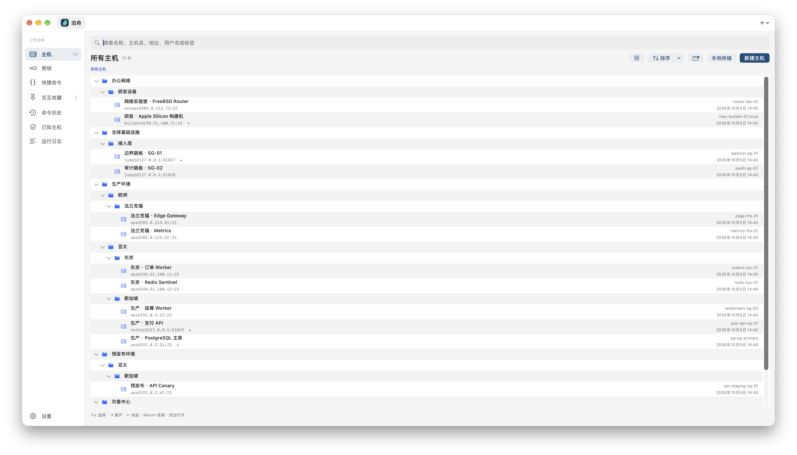
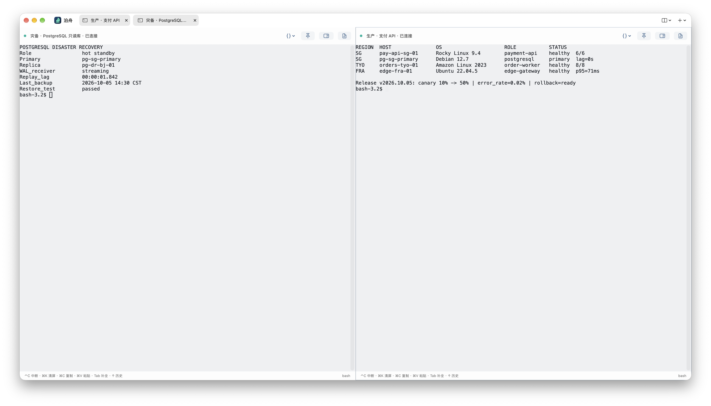
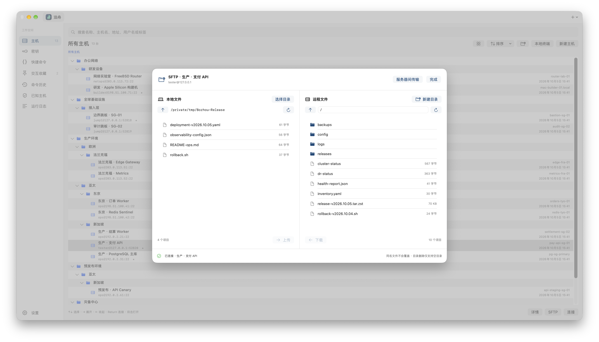
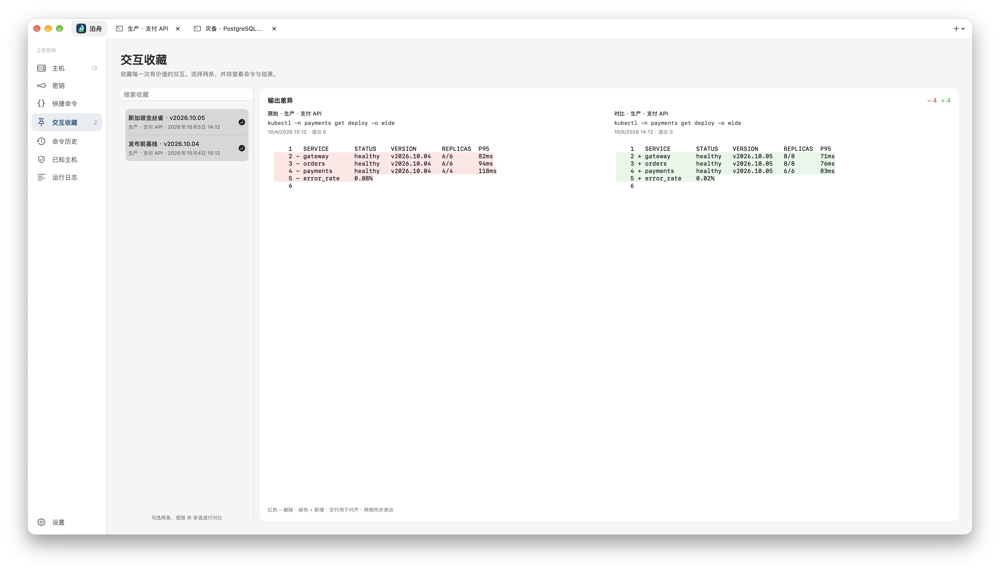

<h1 align="center">泊舟 Bozhou</h1>

<p align="center"><strong>为多主机运维准备的原生 macOS SSH 工作台</strong></p>

<p align="center">把主机、连接、终端、文件传输和每次操作的上下文，集中在一个本地应用里。</p>

<p align="center"><code>macOS 14+</code> · <code>Apple Silicon</code> · <code>SwiftUI</code> · <code>系统 OpenSSH</code> · <code>MIT</code></p>

<p align="center">
  <a href="#安装">安装</a> ·
  <a href="#快速上手">快速上手</a> ·
  <a href="#使用示例">使用示例</a> ·
  <a href="#开发与贡献">参与开发</a>
</p>



> 图中为隔离演示环境：生产、预发布、灾备与研发设备统一编排，所有主机、账号、地址和指标均为虚构数据。

## 核心能力

- **组织复杂资产**：用嵌套目录、标签、星标、搜索和排序管理主机；自定义名称与登录后采集的主机名、系统、内核、CPU、内存分别保存。
- **描述完整连接链路**：支持密码、私钥、SSH Agent 和 Kerberos；最多 12 级跳板，每一级都保留自己的账号、端口和认证方式。
- **接入不同网络环境**：支持 SOCKS5、HTTP CONNECT 和本地端口转发；首次连接逐主机确认指纹，指纹变化时拒绝连接。
- **并行处理多个会话**：多标签、左右或上下分屏、本地 Zsh、自动重连、原始 SSH 日志，以及原生中文输入法。
- **保留命令上下文**：Bash / Zsh 自动记录命令、输出和退出码；支持快捷命令、历史搜索、交互收藏、双栏差异对比和 Markdown 导出。
- **在同一处处理文件**：SFTP 上传、下载、浏览和远程文件管理，也可通过本机内存中转两台服务器之间的单个文件。

泊舟直接调用 macOS 自带的 `/usr/bin/ssh`，为每次连接生成独立配置，并使用工作空间自己的指纹库。它不读取 `~/.ssh/config`，不修改用户的 `known_hosts`，也不要求注册账号或在服务器安装 Agent。

## 安装

### 从 Releases 安装

1. 从仓库的 Releases 页面下载 `Bozhou-<版本>-macOS-arm64.zip`、`SHA256SUMS` 和 `MD5SUMS`。
2. 在下载目录校验发布包，优先使用 SHA-256；MD5 仅用于兼容其他完整性检查流程：

```sh
shasum -a 256 -c SHA256SUMS
md5 -r Bozhou-*-macOS-arm64.zip | diff - MD5SUMS
```

3. 解压后将 `泊舟.app` 移到 `/Applications`。

> [!NOTE]
> 当前发布包使用 ad-hoc 签名，尚未经过 Apple Developer ID 签名和公证。macOS 可能阻止首次打开；请先确认下载来源和校验和，再按「系统设置 → 隐私与安全性」中的提示允许打开。

### 从源码安装

需要包含 macOS 26 SDK 的 Xcode 26 或更新工具链、Git 和 Python 3.10+。从仓库页面复制克隆地址并克隆项目后，在项目目录运行：

```sh
cd Bozhou
git submodule update --init --recursive
bash Scripts/install.sh
open "/Applications/泊舟.app"
```

默认安装到 `/Applications`。安装前请退出泊舟；已有应用会保留为带时间戳的备份，现有工作空间不会被覆盖。

## 快速上手

1. 在「密钥」中导入私钥，或准备好密码、SSH Agent、Kerberos 票据。
2. 点击「新建主机」，填写名称、地址、端口、远端用户名和认证方式。
3. 如需跳板，先保存跳板主机，再按实际顺序把它们加入目标主机的「跳板链」。
4. 点击「保存并连接」，通过可信渠道核对首次出现的服务器指纹。
5. 在终端中打开交互侧栏保存重要操作，或返回工作空间进入 SFTP、历史和收藏。

「快捷命令」只会填入终端，不会自动执行。自动重连最多尝试 5 次，间隔为 5、10、30、60、120 秒，五次失败后需要手动发起；重连会创建新的远端 Shell，不会重放命令。

在主机列表或网格中选中主机后，按空格快速查看基本信息，用 ↑↓ 切换，空格或 Esc 关闭。跳板、会话、历史和收藏使用 `名称(hostname)` 标识主机，空间不足时缩为 `名称(...末六位)`，悬停可查看完整名称；尚未采集 hostname 时使用连接地址。

终端页头同时显示连接状态、用户名、地址端口、文件夹路径和 hostname。用 `⌘−` / `⌘=` 缩小、放大当前焦点窗格的字体（10–36 pt）；缩放在当前会话内保留，设置中的字号决定新会话的默认值。输入 `exit` 或发送 EOF，Shell 退出后会自动关闭对应标签或分屏窗格。

## 使用示例

下面模拟一次跨地域发布检查。同一工作空间同时管理新加坡、东京、法兰克福和北京的生产、预发布与灾备主机，其中包含 Rocky Linux、Ubuntu、Debian、Amazon Linux、macOS 和 FreeBSD。生产支付 API 需要经过「边界跳板 → 审计跳板」两级链路，并通过本地转发访问目标服务。

### 并行检查生产与灾备

连接支付 API 后执行多地域集群检查，同时把 PostgreSQL 灾备会话加入左右分屏。两个会话保持独立焦点、尺寸和交互记录，可分别使用快捷命令、重连和原始日志。



### 通过 SFTP 分发制品

从同一主机条目打开 SFTP，在双栏视图中对照本地发布清单与远端 `releases`、`config`、`logs`、`backups`。可上传、下载、新建目录，或进入「服务器间传输」复制单个文件。



### 对比发布前后结果

把发布前基线和金丝雀检查保存为交互收藏，勾选两条记录后并排查看差异。版本、实例数、P95 延迟和错误率的变化会按行标出，原始记录仍可按主机名或命令检索。



## 数据与安全

> [!IMPORTANT]
> 主机密码目前以明文保存在本地 SQLite 数据库中。建议优先使用私钥、SSH Agent 或 Kerberos，并限制工作空间及其备份的访问权限。

- 默认工作空间位于 `~/Library/Application Support/Bozhou/`，可在设置中迁移到空目录；迁移完成后原目录仍会保留。
- 私钥只保存文件路径，私钥口令和验证码不会持久化，也不会写入进程参数、环境变量或日志。
- 命令历史和交互收藏可能包含敏感输出，可在设置中关闭记录或清空历史。
- 本地端口转发只监听 `127.0.0.1`；端口冲突会使连接失败。
- 应用不修改用户或服务器的持久化 Shell 配置，不安装远端插件或 Agent。
- 安全问题请优先通过 GitHub 的私密漏洞报告入口提交，详情见 [SECURITY.md](SECURITY.md)。

## 常用快捷键

| 快捷键 | 操作 |
| --- | --- |
| `⌘N` / `⌘T` | 新建主机 / 本地终端 |
| `⌘⇧F` | 搜索主机 |
| `⌘⇧R` / `⌘⇧W` | 重连 / 关闭当前会话 |
| `⌘⇧P` | 收藏最近交互 |
| `⌘K` | 清屏并清除滚动缓冲，保留交互记录 |
| `⌘−` / `⌘=`（或 `⌘+`） | 缩小 / 放大当前终端字体 |
| `空格` / `Esc` | 在主机页面快速查看 / 关闭预览 |
| `⌘C` / `⌘V` / `Ctrl-C` | 复制 / 粘贴 / 中断 |
| `⌘,` | 打开设置 |

## 当前边界

- 发布产物面向 Apple Silicon 和 macOS 14+；Intel 构建及全部 macOS 版本尚未逐一验证。
- SFTP 仅支持单文件顺序传输，不提供目录递归、断点续传或并发队列；目录删除仅支持空目录。
- Bash / Zsh 支持自动记录；其他 Shell 使用手动快照，tmux 内部 Shell 不自动注入记录 Hook。
- 单条交互最多保存 256 KiB 输出，不能还原 Vim、top 等程序的屏幕布局。
- 合计超过 4000 行的输出对比按行位置高亮，不进行语义差异分析。

## 开发与贡献

欢迎提交可复现的 Issue 和范围清晰的 Pull Request。开发约定、测试隔离方式与提交规范见 [CONTRIBUTING.md](CONTRIBUTING.md)，实现模块和关键不变量见 [AGENT.md](AGENT.md)。

<details>
<summary><strong>从源码构建与运行测试</strong></summary>

构建需要 macOS、包含 macOS 26 SDK 的 Xcode 26 或更新工具链、Git 和 Python 3.10+。若系统 `python3` 较旧，可通过 `BOZHOU_PYTHON` 指定其他解释器。

```sh
export BOZHOU_PYTHON="$(brew --prefix python@3.14)/bin/python3.14"

bash Scripts/build.sh release
bash Scripts/test.sh --unit
bash Scripts/test.sh
bash Scripts/test_regressions.sh
bash Scripts/test_native.sh
"${BOZHOU_PYTHON:-python3}" Scripts/test_install.py
"${BOZHOU_PYTHON:-python3}" Scripts/verify_package.py
```

集成测试只监听本机回环地址的随机端口，使用项目内 AsyncSSH 环境，不启动系统 `sshd`，也不连接真实服务器。

</details>

推送与 `VERSION` 一致的签名 tag `release/vX.Y.Z` 后，GitHub Actions 会完成测试、Apple Silicon 构建和包校验，并公开发布 ZIP、`SHA256SUMS` 与 `MD5SUMS`。

泊舟使用 SwiftUI、AppKit、系统 OpenSSH、SwiftTerm 和 SQLite 构建，采用 [MIT 许可证](LICENSE) 开源。第三方依赖和许可证见 [THIRD_PARTY_NOTICES.md](THIRD_PARTY_NOTICES.md)。

项目使用 GPT-6-Astra 辅助开发、代码审查与文档编写。
